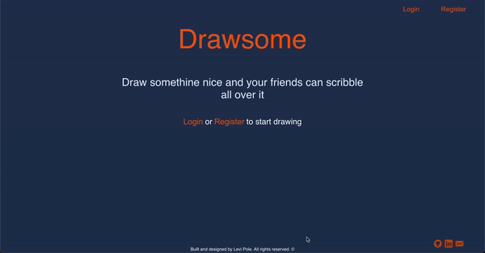
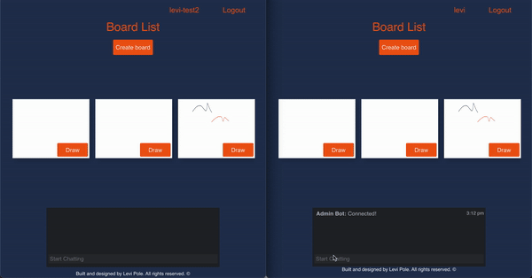
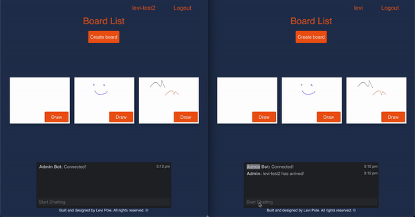

<h1 align="center">✏️</h1>
<h1 align="center">Drawsome</h1>

Drawsome is a coop drawing experience using socket.io and HTML5 canvas that allows you and up to 4 friends create beautiful art or scribble lines together.

## Meta
Created by: Levi Pole

Built with:  ReactJS (frontend), NodeJS (backend), CSS, and a MongoDB database

(Currently Disabled)
**You can find the app at: drawcoop.io**

## 🛠 Set-up and running
Install the dependencies for both the backend and frontend

`npm run install`

Start the development server and client

`npm run start`

## Features
### Accounts
- The site offers account registration and log in features
- User data is saved in a MongoDB backend.

### Boards
- "Boards" is the name for HTML canvas objects that the user can interact with to draw. 
- Boards are stored with their drawing data in MongoDB

### Drawing 
- Drawing is synced between users with Socket.io 
- There are 6 color options
- The save button saves the state of the board
- The back button returns to the board list and saves the state of the board 

## Examples
### Sign in and Drawing

### Drawing Together

### Chatting 

## Feedback
If you have any feedback or suggestions, feel free to send them to my email that you can find on the bottom right of the website :) (leviwp48@gmail.com)

## Contributing

1. Fork it (<https://github.com/leviwp48/draw-coop/fork>)
2. Create your feature branch (`git checkout -b feature/fooBar`)
3. Commit your changes (`git commit -am 'Add some fooBar'`)
4. Push to the branch (`git push origin feature/fooBar`)
5. Create a new Pull Request

