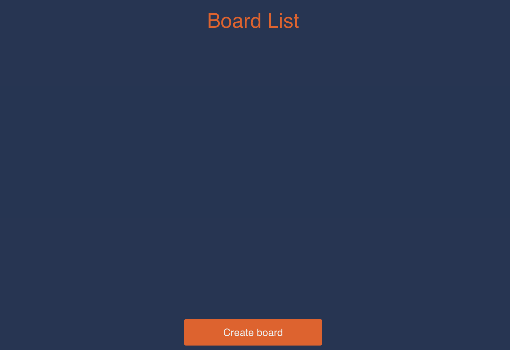

# Draw Coop
draw-coop is a coop drawing experience using socket.io and HTML5 canvas that allows you and up to 4 friends create beautiful art or scribble lines together.

## Meta
Created by: Levi Pole

Built with:  ReactJS (frontend), NodeJS (backend), CSS, and a MongoDB database

(Currently Disabled)
**You can find the app at: drawcoop.io**

## Usage
### Accounts
The site offers account registration and log in features. Simply click the needed button in the top right of the page

### Create a Board 
If you don't have any boards, simply click "Create Board" 

### Drawing 
After creating a board or selecting one from the board list, you can now draw on the board. If anyone else has joined your board, they can draw together with you
// insert image here 

You can create an account now and start drawing on your very own canvas. Friends can hop in through the canvas list and start drawing at the SAME TIME. At the moment only drawing is available and I hope to add other tools in the future.

## Feedback
If you have any feedback or suggestions, feel free to send them to my email that you can find on the bottom right of the website :) (leviwp48@gmail.com)

## Contributing

1. Fork it (<https://github.com/leviwp48/draw-coop/fork>)
2. Create your feature branch (`git checkout -b feature/fooBar`)
3. Commit your changes (`git commit -am 'Add some fooBar'`)
4. Push to the branch (`git push origin feature/fooBar`)
5. Create a new Pull Request

